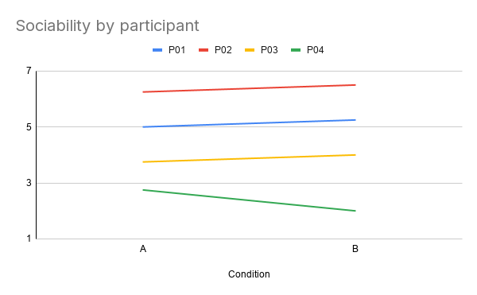
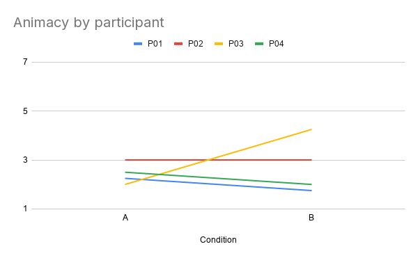
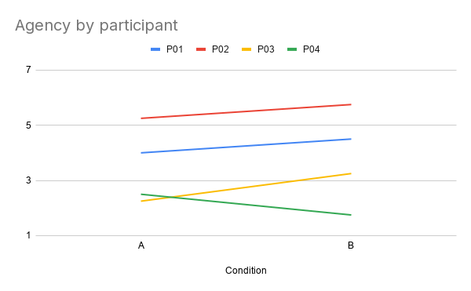
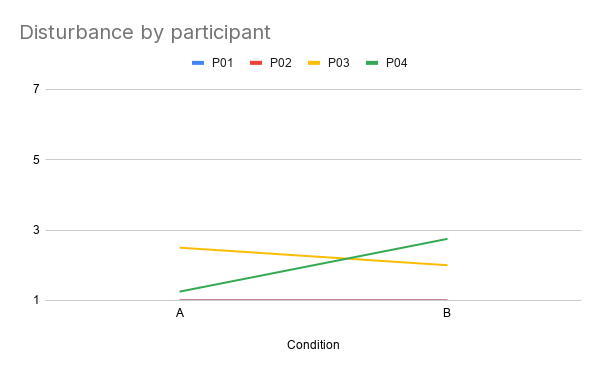

# INFO 5356-030 Lab 2: HRI Research Methods

## Team Members
Nophar Shalom, Bailey Carlson, Wiam Salih

---

## 1. Teleoperation on the Physical Robot

### Final App Cycle Clip
[▶️ Watch the physical Reachy control demo](images/reachy-control.mov)

### Stage Markers (Screenshot / Log Excerpt)


### Sim-to-Real Comparison

The real robot didn't move as smoothly as it did in the simulation. Its motions were often a bit jerky or hesitant, probably because of things the simulation didn't account for, like motor delays, friction in the joints, and small quirks in the hardware. It was also fairly noisy. The motors and gears made sounds with every movement, so you could tell what the robot was doing just by listening to it.

---

## 2. Hello World Application

### Demonstration Clip
[▶️ Watch the application demo](images/hello-world.mov)

```
python - <<'PY'
import time
from reachy_mini import ReachyMini

with ReachyMini() as mini:
    mini.enable_motors()
    mini.goto_target(antennas=[0.3, -0.3], duration=1.0)
    mini.goto_target(antennas=[-0.3, 0.3], duration=1.0)
    mini.goto_target(antennas=[0.0, 0.0], duration=1.0)

   
    mini.start_head_tracking()
    time.sleep(0.1)

    try:
        for _ in range(100):         
            face = mini.get_tracked_face()
            detected = face[0] if isinstance(face, (tuple, list)) else getattr(face, "detected", False)
        
        else:
            print("No face seen")
    finally:
        mini.stop_head_tracking()      
    print("Done")
PY
```
### Stage Markers (Screenshot / Log Excerpt)


### Changes, Expected Outcomes, and Actual Outcomes

With the Hello World code, we edited it to include face tracking alongside the antenna movements from the original code. When a participant moves their head, Reachy could now move its head in regards to their movement, creating a more immersive conversation experience. In this case, because it was a simple change, our expected outcomes seemed to match the actual outcomes.

---

## 3. Custom App on the Physical Robot

[Check out our Custom App code here!](talking_study_app.py)

### Final-Project Topic and App Capabilities

In any case, our final project topic will include interactive features that enable the user to converse with Reachy Mini. Those conversations will require both conversation feedback and face tracking to keep the user engaged. Because our target audience will be middle school children, we want the experience to be as intuitive as possible. This includes making sure that they feel heard and supported by the Reachy Mini, regardless of the task at hand. We are incorporating the capabilities from the Conversational App and the Greetings App for Reachy Mini.

### Integration Map

| Source App | Capability Reused | Modified | Interaction Goal | Final-Project Connection |
|---|---|---|---|---|
| Reachy Mini Conversation App | We used the verbal greetings from the beginning and end of the conversation. | We modified the prompt that the user recieves (e.g. the question asked) as well as the feedback responses provided to the user from Reachy as they converse.| The goal was to make sure that the user feels verbally assured as they speak, to make sure that they know they're heard.| In a normal conversation, the user would need to know that they are being heard and engaged with.|
| Gestures Library | We used the initial greeting gestures (head nodding, antenna crossing, etc.)| We added facial tracking for a smoother user experience overall. | The goal was for maximum attentiveness from the robot, almost as if they are human.| Immersiveness and human-like attention is the goal, especially when it comes to children because they like to get attention.|

### Setup, Launch, and Stop Instructions
#### Setup

We followed the course's Reachy Mini Access Guide to connect to the robot (Option 2, HRIclass_2G WiFi in Tata 429). A few extra things are specific to our app:

1. Make sure no other apps are running in Reachy Mini Control, since only one program can control the robot at a time.
2. In the folder with `talking_study_app.py`, activate our environment:

```
source reachy_mini_env/bin/activate
```

3. Turn the laptop volume up and place the laptop right behind the robot so Reachy's voice seems to come from Reachy.
4. Seat the participant about 50–80 cm in front of the robot, facing its camera so face tracking can pick them up, and keep at least 30 cm clear around the robot.### Robot-Only Demonstration

#### Launch

Each participant did both conditions with the same "place" prompt. We alternated which condition came first so order wouldn't affect the results:

| Participant | First Run | Second Run |
|---|---|---|
| P01 | A | B |
| P02 | B | A |
| P03 | A | B |
| P04 | B | A |

To run a session, use the participant's ID and condition:

```
python talking_study_app.py --participant P01 --condition A --prompt place
```

The facilitator presses **Enter** once the participant is seated. Reachy then greets them and asks the prompt. Each time the participant pauses, the facilitator presses **Enter** again and Reachy responds (and nods in Condition B). This is a "Wizard-of-Oz" setup, since Reachy can't actually understand speech. After 3 minutes, Reachy says goodbye and returns to neutral.

#### Stop

- **End the conversation early:** type `q` and press **Enter**. Reachy says goodbye and finishes normally.
- **Stop the robot immediately:** press **Ctrl+C**. Reachy returns to neutral, and the run is logged as "Interrupted."

One teammate stayed at the laptop during every session so they could stop the robot right away if needed.

### Robot-Only Demonstration

[▶️ Watch the condition A demo](images/conditionA.mov)

[▶️ Watch the condition B demo](images/conditionB.mov)

---

## 4. HRI Research Questions

### Problem Statement
When people talk to someone, they rely on small listener signals, like nods, to judge whether they are being heard. These signals are called backchannels (Yngve, 1970). Social robots are increasingly deployed as conversational partners in homes, schools and care settings, yet many stay motionless while a person speaks. A robot that stays still while listening may come across as inattentive or less socially present, even if its spoken responses are appropriate. Prior work shows that nonverbal backchanneling from virtual agents increases rapport (Gratch et al., 2007) and that robot backchanneling affects how engaged speakers are (Park et al., 2017). Less is known about whether a simple, low-degree-of-freedom robot like Reachy Mini can produce this effect with head movement alone mimicking eye contact. This pilot study tests whether adding active-listening movements changes how sociable adults perceive Reachy Mini to be during a short conversation, and whether these movements affect how long participants choose to speak.

### Construct Map

| Claim | Manipulation | Measures | Expected Evidence |
|---|---|---|---|
| Active-listening movements make Reachy Mini seem more sociable | Verbal responses only vs verbal responses and head movement | HRIES sociability (primary) | Higher sociability scores in Condition B than in Condition A for most participants |
| Participants notice the listening behavior | Same as above | Manipulation-check item | Higher agreement in Condition B than in Condition A |
| Movement encourages participants to keep talking | Same as above | Speaking time (s) | Longer speaking time in Condition B than in Condition A |

#### Independent Variable

The presence or absence of head movements mimicking active listening.

- **Condition A (baseline):** The conversational engagement responses from Reachy continue, but no movement is produced.
- **Condition B (comparison):** The robot performs head tracking in addition to responses.

In both conditions, the Reachy Mini responds to the user with the same prompts, questions, tone of voice, verbal greetings, and order of comments.

#### Outcomes

- **Primary outcome:** HRIES sociability score. This is the mean of the four sociability items, each rated on a 7-point scale, so scores range from 1 to 7. Higher values mean the robot was perceived as more sociable.
- **Secondary outcomes:** HRIES animacy, agency and disturbance scores, each the mean of its four items. Higher values mean greater animacy, agency or disturbance, respectively.
- **Objective outcome:** total participant speaking time in seconds during the conversation window.

#### Manipulation Check

After each completed run, participants rate the statement "The robot responded to what I was saying with head movements" from 1 (strongly disagree) to 7 (strongly agree). The manipulation is considered noticeable if ratings are higher in Condition B than in Condition A.

#### Controls

- The robot's idle pose, antenna position, gaze direction, and start and end pose (neutral) are identical in both conditions.
- The conversation topic (place) and verbal responses are the same across all participants and within-subject conditions.
- The room layout, participant seat distance from the robot, lighting and facilitator position are the same for every session.
- The facilitator reads a standardized script and does not react to the robot's behavior.
- All participants receive both condition in the same order (A, then B)

#### Potential Confounds

- **Prompt content:** The prompt may be difficult to talk about.
- **Order and novelty effects:** Participants may talk more or rate the robot differently in the second session simply because the robot is no longer novel.
- **Detection errors:** Facilitator robot response timing may cause disruptions in the conversational flow between the user and robot.
- **Facilitator presence:** Participants may speak to please the facilitator rather than responding to the robot. The facilitator sits out of the participant's line of sight.

#### Measurement Scales and Construct Validity

The HRIES (Spatola, Kühnlenz & Cheng, 2021) has 16 items rated on a 7-point scale, with four items per dimension:

- **Sociability:** warm, likeable, trustworthy, friendly
- **Animacy:** human-like, real, alive, natural
- **Agency:** self-reliant, rational, intentional, intelligent
- **Disturbance:** scary, strange, creepy, weird

### Research Questions and Hypotheses

**H1 (confirmatory):** Participants will report higher HRIES sociability scores in the movement condition (B) than in the still condition (A).

**H2 (confirmatory):** Participants will speak longer in the movement condition (B) than in the still condition (A).

**RQ1 (exploratory):** How do active-listening movements affect participants' HRIES disturbance ratings and their descriptions of the robot's behavior?

---

## 5. HRI User Study

### Conditions Table

| Element | Condition A | Condition B | Held Constant |
|---|---|---|---|
| Primary factor | No active listening movements. | Head tracking, active listening movements. | Reachy's verbal responses to each user comment. |
| Robot behavior | The robot holds its neutral pose for the whole conversation. | The robot does not hold its neutral pose and tracks the user's head movements. | Starting and ending poses are positioned at neutral. |
| Interaction | The participant talks to the robot about assigned prompts. | Same task. | Instructions, room setup, facilitator, and operator. |

### Participants

#### Target Population and Sampling Rationale

Our target population is adults who might talk to a social robot in everyday settings, such as at home, at a front desk or in a classroom. For this pilot, we recruited four adult volunteers from the Cornell Tech community who are not members of our team. We used a convenience sample because the goal of a pilot is to test whether the task, the robot behavior and our measures work before running a larger study, not to make claims about the general population.

#### Demographics, Robot Familiarity, and Condition Order

We collected only information that could reasonably affect how someone talks to or judges a robot: age range, how comfortable they are speaking English, and how familiar they are with robots, rated from 1 (never interacted with a robot) to 7 (work with robots regularly). Each participant was given a unique ID. All participants receive condition A then B and get the same verbal prompts.


| Participant ID | Age | English Comfort | Robot Familiarity (1–7) |
|---|---|---|---|
| P01 | 22| fluent| 4|
| P02 | 23| fluent| 1|
| P03 | 25| fluent| 3|
| P04 | 27| fluent| 3|

#### Limits on Transferability

With only four participants, all drawn from a tech-focused graduate campus, our results can't tell us how people in general would react to an actively listening robot. Our participants are likely more comfortable with technology and more curious about robots than most people. They also know they are taking part in a class study, which may make them more patient or more generous in their ratings. Any pattern we find should be treated as a reason to run a larger study, not as a conclusion

### Study Task

#### Task and Standardized Instructions

#### Trial Definitions

In each condition, the participant sits facing Reachy Mini and has a conversation about the following topic:

- **Place:** "Tell the robot about a place you like to spend time, and why you like it."

We chose this topic because anyone can talk about it without special knowledge, and they're personal enough to encourage natural, flowing speech. The facilitator reads the same instructions before each condition:

> "Please respond to the robot's prompts. Speak to it as you would to someone who is listening to you. There's no right or wrong way to do this."

If the participant stops talking for more than 15 seconds, the facilitator can say once: "Feel free to keep going, or add anything else that comes to mind."

| Trial Status | Definition |
|---|---|
| Completed | The full conversation ran, the robot behaved as intended for each condition, and the participant filled out the questionnaire. |
| Interrupted | The conversation was paused because of a noise, a question from the participant, or the operator pressing stop, and then resumed. |
| Failed | The condition couldn't be delivered as designed, for example the robot moved in Condition A, didn't move in Condition B, or lost connection, or the participant chose to stop. |
| Repeated | A failed condition that we ran again from the start. We only repeat a condition if the failure happened in the first 30 seconds, and we note the repeat in the session record. |

#### Setting and Environmental Controls

Every session takes place in the HRI Lab. Reachy Mini sits on a table at roughly the participant's seated eye level, and the participant's chair is placed at about 1 meter in front of it. The facilitator sits to the side, out of the participant's direct line of sight, so the participant naturally speaks to the robot rather than to a person. A second team member sits at the laptop with the stop control, also out of direct view.

### Facilitator Script

**Before the participant arrives**

We power on the robot, confirm the battery and motors look normal, and run a short test of both conditions to make sure the robot stays still in Condition A and nods and head tracks in Condition B. We check that the log is recording and put the robot in its neutral pose.

**Welcome and agreement to participate**

> "Thanks for participating! Today you'll have two short conversations with a small robot called Reachy Mini, and after each one you'll fill out a brief questionnaire. We're interested in how people experience talking to robots. This interaction will not be recorded. Your responses to the questionnaire will be stored and you can skip any question or stop at any time without any problem. Do you have any questions?"

**Background questions**

We ask the participant their age range, how comfortable they are speaking English, and how familiar they are with robots (1–7).

**Conversations**

We read the standard instructions and signal the operator team member to start the conversation. After the first condition conversation, the operator will begin the second condition conversation. After each conversation is complete, we will verbally administer the questionnaire, meaning each participant will complete the questionnaire twice.

**Debrief**

> "Thank you. Now we can tell you what we were looking at. During the first conversation, the robot had only verbal responses. During the second conversation, the robot had both verbal responses and head movements mimicking active listening. We wanted to know whether the presence/absence of movement changes how friendly or attentive the robot seems, and whether they affect how much people talk. Do you have any questions?"

### Measures

#### HRIES Questionnaire

Participants rate how well each word describes the robot on a 7-point scale, from 1 (not at all) to 7 (very much). The 16 words are shown in a mixed order, and the same order is used every time. Each dimension is scored separately.

| Dimension | Items |
|---|---|
| Sociability (primary outcome) | Warm, Likeable, Trustworthy, Friendly |
| Animacy | Human-like, Real, Alive, Natural |
| Agency | Self-reliant, Rational, Intentional, Intelligent |
| Disturbance | Scary, Strange, Creepy, Weird |

#### Objective Behavioral Measure

Total speaking time, in seconds, during the conversation. The app measures this from the microphone by adding up the time the participant was speaking. We also record how many times the facilitator had to prompt the participant to keep going.

#### Open-Ended Question

"How would you describe the robot's behavior while you were talking?"

#### Manipulation-Check Item

"The robot responded to what I was saying with head movements." Rated from 1 (strongly disagree) to 7 (strongly agree).

---

## 6. Research Data

### Datasets

[Raw Data Google Sheet Found Here](https://docs.google.com/spreadsheets/d/1r0SRfQDrf8Qvk5bd2O6SjLyphTbME4_NkkX86LKy_M8/edit?gid=618784505#gid=618784505)

### Data Dictionary

| Variable | Definition | Response Scale | Units |
|---|---|---|---|
| participant_id | De-identified participant ID | P01–P04 | none |
| age | Participant's age | whole number | years |
| english_comfort | How comfortable the participant is speaking English | self-described (e.g., "fluent") | none |
| robot_familiarity | Prior experience with robots | 1 (never interacted with a robot) to 7 (work with robots regularly) | points |
| condition | Which robot behavior this row describes | A (speech only, no movement) or B (speech with greeting bow, listening pose, face tracking, nods and goodbye gesture) | none |
| movement | Whether robot movement was turned on | off (A) or on (B) | none |
| nod_amplitude_deg | Size of the robot's nod | 0 (A) or 10 (B) | degrees |
| warm, likeable, trustworthy, friendly | HRIES sociability items | 1 (not at all) to 7 (very much) | points |
| human_like, real, alive, natural | HRIES animacy items | 1 to 7 | points |
| self_reliant, rational, intentional, intelligent | HRIES agency items | 1 to 7 | points |
| scary, strange, creepy, weird | HRIES disturbance items | 1 to 7 | points |
| sociability | Average of the four sociability items; higher means the robot seemed more sociable | 1 to 7 | points |
| animacy | Average of the four animacy items; higher means the robot seemed more alive | 1 to 7 | points |
| agency | Average of the four agency items; higher means the robot seemed more capable of acting on its own | 1 to 7 | points |
| disturbance | Average of the four disturbance items; higher means the robot seemed more unsettling | 1 to 7 | points |
| manip_check | Agreement with "The robot responded to what I was saying with head movements" | 1 (strongly disagree) to 7 (strongly agree) | points |
| open_response | Participant's answer to "How would you describe the robot's behavior while you were talking?" | free text | none |
| trial_status | Outcome of the trial | Completed, Interrupted, Failed, or Repeated | none |

### Scoring Calculations

Each HRIES dimension score is the average of its four items:

- **Sociability** = (warm + likeable + trustworthy + friendly) ÷ 4
- **Animacy** = (human_like + real + alive + natural) ÷ 4
- **Agency** = (self_reliant + rational + intentional + intelligent) ÷ 4
- **Disturbance** = (scary + strange + creepy + weird) ÷ 4

For each participant, we calculate the within-person difference on every measure as their Condition B value minus their Condition A value. A positive difference means the score was higher when the robot moved.

In the Google Sheet, these calculations are done with formulas in the Responses and Summary tabs, so anyone can check them by entering the raw ratings.

---

## 7. Analysis and Reflection

### Results Table

Values are mean (SD) [median]. The difference column is Condition B minus Condition A, so a positive value means the score was higher when the robot moved. All HRIES scores and the manipulation check are on a 1–7 scale; higher values mean more sociable, more alive, more capable of acting on its own, and more unsettling, respectively. n = 4 in each condition.

| Measure | Condition A (speech only) | Condition B (speech + movement) | Mean Within-Participant Difference (B − A) |
|---|---|---|---|
| HRIES Sociability | 4.44 (1.52) [4.38] | 4.44 (1.92) [4.63] | 0.00 |
| HRIES Animacy | 2.44 (0.43) [2.38] | 2.75 (1.14) [2.50] | +0.31 |
| HRIES Agency | 3.50 (1.40) [3.25] | 3.81 (1.71) [3.88] | +0.31 |
| HRIES Disturbance | 1.44 (0.72) [1.13] | 1.69 (0.85) [1.50] | +0.25 |
| Manipulation Check | 2.50 (2.38) [1.50] | 5.50 (1.29) [5.50] | +3.00 |

### Participant-Level Paired Figure

Each line shows one participant's score in Condition A (speech only) and Condition B (speech + movement). Scores range from 1 to 7.

<p>
  
  
  
  
</p>

### Interpretation by HRIES Dimension

**Sociability (primary outcome; higher = warmer and friendlier).** The average was identical in both conditions (4.44). Three of four participants rated the moving robot slightly more sociable, each by only 0.25 points, while P04 rated it 0.75 points lower. Participants differed far more from each other (from 2.75 to 6.25 in Condition A) than any participant changed between conditions, so movement did not noticeably change how sociable the robot seemed.

**Animacy (higher = more alive and natural).** Animacy was low in both conditions (2.44 in A, 2.75 in B), meaning participants did not see the robot as very lifelike either way. The small increase in B came almost entirely from P03, whose score rose by 2.25 points; P01 and P04 rated the moving robot slightly lower, and P02 did not change. The effect of movement on animacy was therefore inconsistent across people.

**Agency (higher = more capable of acting on its own).** Agency rose slightly in B (3.50 to 3.81), and three of four participants gave higher scores there. P04 was again the exception, rating the moving robot lower. This suggests movement may make the robot seem a little more intentional to some people, but the change is small.

**Disturbance (higher = more unsettling).** Disturbance stayed low in both conditions (1.44 in A, 1.69 in B), so neither version of the robot was found very unsettling. The slight increase in B was driven by P04, whose score rose by 1.5 points and who described the movement as bug-like. P01 and P02 did not change, and P03's disturbance went down. Because higher disturbance is the undesirable direction, this shows that movement can backfire for some people even when others find it appealing.

**Manipulation check.** All four participants agreed more strongly in Condition B that the robot responded with head movements (2.50 in A, 5.50 in B), confirming that participants noticed the difference between conditions. P02 gave a high rating (6) even in Condition A, when the robot did not move, which may mean they interpreted the item loosely.

### Within-Participant Differences (B − A)

| Participant | Sociability | Animacy | Agency | Disturbance | Manipulation Check |
|---|---|---|---|---|---|
| P01 | +0.25 | −0.50 | +0.50 | 0.00 | +2 |
| P02 | +0.25 | 0.00 | +0.50 | 0.00 | +1 |
| P03 | +0.25 | +2.25 | +1.00 | −0.50 | +5 |
| P04 | −0.75 | −0.50 | −0.75 | +1.50 | +4 |
| Participants higher in B | 3 of 4 | 1 of 4 | 3 of 4 | 1 of 4 | 4 of 4 |

### Qualitative Coding Table

| Category | Definition | Summary of Findings | Example Paraphrase |
|---|---|---|---|
| Endearing appearance | The participant describes the robot as cute, adorable or likeable in its look or features. | Mentioned in 1 of 4 Condition A responses and 2 of 4 Condition B responses. In B, the cuteness was tied to the antennas ("ears") and their movement. | P03 (B) found the robot adorable and especially liked its little ears. |
| Generic or repetitive speech | The participant says the robot's replies were generic, plain, repeated, or unrelated to what they said. | The most consistent theme, appearing in 2 of 4 responses in each condition (P02 and P04 both times). Movement did not change this impression. | P02 (A) said every reply was generic and nothing was specific to what they had said. |
| Conversational timing | The participant comments on when or how quickly the robot responded. | Mentioned in 3 of 4 Condition A responses and none in B. Comments were mixed: replies felt oddly timed or fast to some, while one participant was impressed that it knew when they stopped talking. | P01 (A) felt the robot's responses came at odd moments. |
| Reaction to robot movement | The participant notices the robot's movement, or its absence, and says how it felt. | Mentioned in 1 of 4 Condition A responses (noting no movement) and 3 of 4 Condition B responses. Two participants found the movement pleasant and natural; one found it bug-like. | P04 (B) said the movements looked like those of an insect, such as a roach. |


#### Demographics, Robot Familiarity, and Condition Order

We collected only information that could reasonably affect how someone talks to or judges a robot: age, how comfortable they are speaking English, and how familiar they are with robots, rated from 1 (never interacted with a robot) to 7 (work with robots regularly). Each participant was given a de-identified ID. All participants completed Condition A first and Condition B second, and both conversations used the same "place" prompt.

| Participant ID | Age | English Comfort | Robot Familiarity (1–7) | Condition Order | Prompt | Trial Status (A / B) |
|---|---|---|---|---|---|---|
| P01 | 22 | Fluent | 4 | A then B | Place | Completed / Completed |
| P02 | 23 | Fluent | 1 | A then B | Place | Completed / Completed |
| P03 | 25 | Fluent | 3 | A then B | Place | Completed / Completed |
| P04 | 27 | Fluent | 3 | A then B | Place | Completed / Completed |

Participants were 22–27 years old (mean 24.3), all fluent in English, with low-to-moderate robot familiarity (mean 2.75 out of 7). All eight trials were completed with no interruptions, failures, or repeats, and no data were missing.

**Protocol deviation:** The lab called for counterbalanced condition order (AB, BA, AB, BA), but all four participants received A then B. We note this as a deviation and discuss it as a threat to validity in Section 7.3.

---

### Answers to Research Questions / Hypotheses

**H1: Participants will report higher HRIES sociability scores in Condition B (movement) than in Condition A (still).**
**Evidence: mixed, and overall insufficient to support H1.**

- **Quantitative:** Mean sociability was identical in both conditions (4.44 vs. 4.44). P01, P02, and P03 each rated the moving robot 0.25 points higher, while P04 rated it 0.75 points lower. These changes are much smaller than the differences between participants (2.75 to 6.25 in Condition A alone).
- **Behavioral:** Our observations of participant movement suggest the strength of the manipulation varied from person to person. Head tracking only moves the robot when the participant moves. P02 sat still and did not notice the robot moving, and P04 only turned side to side on a spinning chair, so both likely saw much less robot movement than P01 and P03, who moved their heads while talking.
- **Qualitative:** The most consistent theme across both conditions was that Reachy's replies were generic (P02 and P04 in both conditions). P02 said their opinion did not change because the robot asked the same question and gave similar responses. Participants' social impressions seemed driven more by what Reachy said than by how it moved.

**H2: Participants will speak longer in Condition B than in Condition A.**
**Evidence: insufficient (not tested).**

- **Behavioral:** We did not record speaking time. Our final app used a Wizard-of-Oz setup in which the facilitator triggered Reachy's responses, so it did not measure participant speech from the microphone. We cannot answer H2 with this pilot, and we list this as a deviation from our planned measures.
- **Qualitative:** Some answers hint at engagement. P01 liked the movement and said more cues while talking would help, and P02 noted Reachy added prompts like "tell me more." But none of the answers describe talking more or less to the moving robot.

**RQ1 (exploratory): How do active-listening movements affect HRIES disturbance ratings and participants' descriptions of the robot?**
**Evidence: mixed.**

- **Quantitative:** Disturbance stayed low in both conditions (1.44 in A, 1.69 in B). P01 and P02 did not change, P03's disturbance went down (2.50 to 2.00), and P04's went up sharply (1.25 to 2.75), accounting for the whole increase.
- **Behavioral:** P04 was the participant who moved least toward the robot (only turning side to side on a spinning chair) and said they did not like the robot's movement.
- **Qualitative:** Three of four Condition B answers mentioned the movement. P01 and P03 found it cute and natural, with P03 saying it felt more natural when it responded in a non-jerky way. P04 compared the movement to a bug, such as a roach.
- **Takeaway:** Movement did not make Reachy unsettling for most people, but it can backfire. Whether it works seems to depend on how smoothly and naturally the robot moves.

### Convergence and Disagreement Among Evidence

**Where the evidence agrees:**

- **Participants noticed the movement.** All four participants gave higher manipulation-check ratings in Condition B (mean 2.50 to 5.50), and three of four mentioned the robot's movement in their Condition B answers.
- **More participant movement meant a stronger effect.** All three forms of evidence line up for P03. P03 moved and paid attention to the robot's motion, had the largest manipulation-check increase (+5), the largest animacy increase (+2.25), and described the robot as "really cute" and "more natural." P02, who sat still and did not notice the robot moving, had the smallest manipulation-check increase (+1) and no change in animacy. Because the robot's tracking movement depends on how much the participant moves, participants effectively received different "doses" of Condition B.
- **P04's reactions are consistent.** P04 rated the moving robot lower on sociability, animacy, and agency, higher on disturbance, described it as bug-like, and was observed not liking the movement. This points to a real negative reaction rather than random noise.

**Where the evidence disagrees:**

- **Noticing movement did not change ratings.** Participants clearly noticed the movement, yet sociability did not change on average. Noticing a behavior is not the same as finding it socially meaningful or intentional.
- **Timing complaints disappeared in Condition B.** In Condition A, three of four participants commented on response timing (P01 "oddly timed," P03 "a little fast," P02 impressed that it knew when they stopped talking). None of the Condition B answers mentioned timing, even though the timing worked the same way. Movement may have made the same responses feel better timed, even though this did not show up in the HRIES scores.
- **P02's Condition A rating doesn't fit.** P02 gave a manipulation-check rating of 6 in Condition A, when the robot did not move, and was also observed not to notice robot movement. P02 may have read the item as "the robot responded to me" rather than "responded with head movements."

### Alternative Explanations

- **The voice and script dominated.** Reachy's replies were identical, generic, and scripted in both conditions, and played from a laptop speaker. Participants may have mainly judged Reachy by what it said, hiding any effect of movement. P02's comment that nothing changed "because it was the same question and it said the same thing" supports this.
- **Participants experienced different amounts of movement.** Since face tracking responds to the participant's own movement, participants who sat still (P02, P04) saw less robot movement than those who moved (P01, P03). Small average effects may reflect a weak manipulation for half the sample, not a weak effect of movement itself.
- **Movement quality, not movement itself.** As noted in our sim-to-real comparison, the real robot moved somewhat jerkily and its motors were audible. P04's "roach" comment and P03's note about non-jerky movement suggest people react to how the robot moves, not just whether it moves.
- **Order and repetition.** Every participant did Condition A first and repeated the same "place" story in Condition B. Any change in B could come from familiarity, reduced novelty, or retelling the same story, not from the movement.

### Threats to Validity

1. **Sample size.** With four participants, one person can shift the averages a lot. P04 alone canceled out the small sociability gains from the other three. We can describe patterns, but we cannot draw conclusions or run meaningful statistical tests.
2. **Convenience sampling.** Participants were Cornell Tech graduate students aged 22–27, all fluent in English, with low-to-moderate robot familiarity. They are very different from our intended final-project users, middle school children, who may react to robot movement and voice differently.
3. **Order effects.** All participants did A before B, so the effect of movement is completely mixed up with being the second session. Participants were more familiar with the robot and repeating the same story, so we cannot separate the effect of movement from the effect of going second.
4. **Measurement validity.** The manipulation-check wording may have been ambiguous, as P02's rating of 6 in Condition A suggests. We also read the questionnaire aloud, which may have encouraged polite, socially acceptable answers and could explain why disturbance stayed so low. Finally, we planned to measure speaking time but did not, so H2 could not be tested.
5. **Robot and manipulation variability.** Because head tracking depends on the participant's movement, the intensity of Condition B varied between participants (P02 and P04 moved very little). Tracking may also have been affected by lighting and seating position.
6. **Experimenter influence.** In our Wizard-of-Oz setup, a team member decided when Reachy responded. They knew which condition was running and could have timed responses differently without meaning to. Several answers were recorded as paraphrases (e.g., P04's Condition B response is in the third person), so the facilitator's wording may have shaped how responses were recorded.

### Proposed Interaction Improvement

Our data point to two problems: generic speech and uneven movement. The most important fix is making Reachy's replies respond to what the participant actually says. Participants in both conditions said Reachy's answers felt generic, and P02 said nothing changed because the robot "said the same thing." We would use speech recognition from the Reachy Mini Conversation App to pick out keywords and reflect them back (e.g., "The beach sounds really relaxing"). We would also detect pauses automatically from the microphone, removing facilitator timing errors. To make movement consistent, we would add small listening nods and antenna movements on a regular rhythm, so that participants who sit still still see active listening. P01 asked for exactly this kind of cue.

### Proposed Follow-Up Study

We would run a larger within-subjects study with about 20 participants. We would counterbalance the condition order (half AB, half BA) and use two comparable prompts (e.g., "a place you like" and "a hobby you enjoy"), also counterbalanced, so no one repeats the same story.

Both conditions would use the improved, content-aware replies, so speech quality no longer hides the effect of movement. Condition B would combine face tracking with regular nods, so every participant receives a similar amount of listening behavior. Speaking time would be recorded automatically from the microphone, and we would log how much the robot moved in each session. The questionnaire would be completed privately on a tablet to reduce social-desirability bias.

Since our final project targets middle school children, a second phase would repeat the study with that age group. It would include parent consent and child assent and simplified questionnaire items, to test whether active-listening movement matters more to children than to adult graduate students.

---

## 8. Report
### Introduction

When people talk, they rely on small signals from the listener, such as nods, short verbal replies like "mm-hmm," and eye contact, to tell whether they are being heard. These listener signals are known as backchannels (Yngve, 1970), and they help keep a conversation going by showing the speaker that the listener is paying attention. As social robots are increasingly used as conversation partners in homes, schools, and care settings, they need to show the same kind of attentiveness. However, many robots stay completely still while a person speaks. A robot that does not move while listening may seem inattentive or less socially present, even if what it says is appropriate.

Prior work suggests that nonverbal listening behavior matters. Gratch et al. (2007) found that virtual agents that responded to speakers with nods and posture shifts created a stronger sense of rapport than agents that did not. In a study with a physical robot, Park et al. (2017) found that children told longer, more engaged stories to a robot that gave attentive backchannel responses than to one that did not. Less is known about whether a simple robot with only a few degrees of freedom, like Reachy Mini, can produce similar effects through head movement alone. Reachy Mini has no face that can make expressions and no arms, so any sign of attention has to come from its head, its antennas, and its voice.

This question also matters for our final project, which will explore conversational interactions between Reachy Mini and middle school children. If simple listening movements make Reachy seem more sociable and keep people talking, they are a low-cost way to make conversations with small robots feel more natural. If they do not, designers may need to focus on other cues, such as what the robot says.

To explore this, we ran a small within-subjects pilot study in which adult participants had two short conversations with Reachy Mini. In one condition the robot only spoke; in the other it also moved its head in active-listening ways. We measured how participants perceived the robot using the Human–Robot Interaction Evaluation Scale (HRIES; Spatola et al., 2021), along with behavioral observations and an open-ended question. Our research questions and hypotheses were:

- **H1 (confirmatory):** Participants will report higher HRIES sociability scores when Reachy Mini uses active-listening movements (Condition B) than when it does not move (Condition A).
- **H2 (confirmatory):** Participants will speak longer in Condition B than in Condition A.
- **RQ1 (exploratory):** How do active-listening movements affect participants' HRIES disturbance ratings and their descriptions of the robot's behavior?

### Method

#### Reachy Mini Application

We built a custom Python application, `talking_study_app.py`, that combines capabilities adapted from two Reachy Mini apps. From the Conversation App, we adapted turn-taking and verbal responses: the robot greets the participant, asks a question, replies when the participant pauses, and says goodbye. From the Greetings App, we adapted the greeting bow and face tracking, which turns Reachy's head toward the participant's face.

Reachy Mini cannot actually understand what participants say, so the study used a Wizard-of-Oz setup: a team member pressed a key each time the participant paused, which triggered the robot's next reply. The robot's voice was generated with the macOS text-to-speech voice at 175 words per minute and played through a laptop speaker placed directly behind the robot. Replies cycled in a fixed order: "Got it," "I see," "Tell me more," "That sounds interesting," "Oh, really?" and "Go on." The app ran from a laptop connected to the robot over the HRIclass_2G WiFi network. Each run was logged automatically with the participant ID, condition, start and end times, number of marked pauses, and trial status.

#### Experimental Conditions

The study manipulated one factor: whether Reachy Mini produced active-listening movement.

- **Condition A (speech only):** Reachy spoke the same greeting, question, replies, and goodbye as in Condition B, but stayed in its neutral pose the whole time.
- **Condition B (speech + movement):** In addition to the same speech, Reachy bowed during the greeting, held an attentive listening pose, tracked the participant's face, nodded (10° amplitude, 0.6 s) with each reply, and moved its antennas during the goodbye.

Everything else was held constant across conditions: the robot's words and their order, voice and speaking rate, the prompt, the 3-minute conversation window, the neutral start and end pose, the room setup, and the facilitator and operator. The full conditions table is in Section 5 and the Appendix.

#### Participants

We recruited four adult volunteers (P01–P04) from the Cornell Tech community who were not members of our team. Participants were 22–27 years old (M = 24.3), all fluent in English, and reported low-to-moderate familiarity with robots (M = 2.75 on a 1–7 scale). We used a convenience sample because the goal of this pilot was to test whether the task, robot behavior, and measures worked, not to generalize to a broader population. Each participant was assigned a de-identified ID, and no names or contact information were stored.

#### Task

In each condition, participants had a short conversation with Reachy Mini about the same topic: a place they like to visit. Reachy asked, "Can you tell me about a place you like to visit?" and participants responded as they would to someone listening to them. We chose this topic because it requires no special knowledge and encourages natural, personal speech. Each conversation lasted up to 3 minutes and ended when the time ran out or the participant finished talking.

#### Setting

All sessions took place in the same lab room. Reachy Mini sat on a table at roughly the participant's seated eye level, and the participant sat about 1 meter in front of it, facing the robot's camera. The facilitator sat to the side, out of the participant's direct line of sight. A second team member sat at the laptop that controlled the robot, also out of direct view, and could stop the robot at any time. Room layout, seating, lighting, and positions were the same for every session.

#### Procedure

Before each session, we powered on the robot, confirmed that the motors and logging were working, and ran a short test of both conditions. When the participant arrived, the facilitator explained the study, answered questions without revealing the hypotheses, and confirmed their agreement to participate. We then collected the participant's age, English comfort, and robot familiarity.

The facilitator read the same standardized instructions before each conversation: "Please respond to the robot's prompts. Speak to it as you would to someone who is listening to you. There's no right or wrong way to do this." All participants completed Condition A first and Condition B second. After each conversation, the facilitator read the questionnaire aloud and recorded the participant's answers, so each participant completed it twice. After both conversations, the facilitator debriefed the participant on the study's purpose. Finally, we checked each session record for missing data, interruptions, robot faults, and protocol deviations.

**Protocol deviations:** First, condition order was not counterbalanced as the lab required; all participants received A then B. Second, total speaking time was planned as the objective measure but was not recorded, because the Wizard-of-Oz version of the app did not measure participant speech from the microphone. As a result, H2 could not be tested.

#### HRIES Questionnaire

Participants rated the robot after each condition using the 16-item Human–Robot Interaction Evaluation Scale (HRIES; Spatola et al., 2021). Each item is a single word rated on a 7-point scale from 1 (not at all) to 7 (very much), and the items were presented in the same mixed order each time. The items form four dimensions of four items each:

- **Sociability (primary outcome):** warm, likeable, trustworthy, friendly
- **Animacy:** human-like, real, alive, natural
- **Agency:** self-reliant, rational, intentional, intelligent
- **Disturbance:** scary, strange, creepy, weird

Each dimension score is the average of its four items (range 1–7), and higher values mean more of that trait. For disturbance, higher scores are undesirable. The four dimensions were scored and interpreted separately and never combined into one overall score.

To confirm that participants noticed the manipulation, we added one manipulation-check item after each condition: "The robot responded to what I was saying with head movements," rated from 1 (strongly disagree) to 7 (strongly agree).

#### Objective Measure

Our planned objective measure was total participant speaking time during each conversation. Because it was not recorded (see Procedure), we relied on the facilitator's behavioral observations of how each participant moved during the session, for example whether they moved their head while talking or sat still. This matters because the robot's face tracking only moves when the participant moves, so participant movement affects how much robot movement each person actually saw. The app also logged the number of pauses the operator marked and the length of each conversation.

#### Qualitative Prompt

After each condition, participants answered one neutral, open-ended question: "How would you describe the robot's behavior while you were talking?" Answers were recorded in writing by the facilitator.

#### Analysis Approach

With only four participants, we did not run inferential statistics; the analysis is descriptive. For each condition, we calculated the mean, standard deviation, and median of each HRIES dimension and the manipulation check. For each participant, we calculated the within-person difference (Condition B minus Condition A) on every measure, so a positive value means a higher score when the robot moved. We also counted how many participants scored higher in Condition B, and created paired participant-level figures connecting each person's scores across conditions. All calculations are done with formulas in our Google Sheet so they can be checked and reproduced.

For the open-ended answers, we developed four categories from recurring themes: endearing appearance, generic or repetitive speech, conversational timing, and reaction to robot movement. We defined each category and applied it consistently across all eight responses, counting how often each appeared in each condition. Finally, we compared the quantitative, behavioral, and qualitative evidence to see where they agreed or disagreed, and labeled the evidence for each research question as supportive, contradictory, mixed, or insufficient.

### Results 

#### Participant Accounting

All four of our recruited participants (P01–P04) fully completed both conditions, resulting in eight completed trials. As previously mentioned, these participants were 22–27 years old with a mean of 24.3, all fluent in English, with low-to-moderate robot familiarity resulting in a mean familiarity score of 2.75/7.

#### HRIES Results

Following the completion of each trial, all participants engaged in the full verbal, HRIES-based questionnaire. The results captured by the HRIES questionnaire are presented in Table 1. Of particular note is the consistency of mean sociability scores across conditions (4.44). However, the remaining three HRIES dimensions saw in increase in their respective means from condition A to Condition B. Animacy increased from 2.44 to 2.75, agency from 3.50 to 3.81, and disturbance from 1.44 to 1.69. The manipulation check also increased from 2.50 in Condition A to 5.50 in Condition B.

Despite the observed trends in the dimensional means mentioned above, participant level responses varied across dimensions. Three of four participants reported higher sociability and agency scores in Condition B, while only one reported higher animacy and disturbance scores. The largest rating differences within a given participant were a 2.25-point increase in animacy and a 1.50-point increase in disturbance towards Condition B.

#### Objective Findings

Because our final app used a Wizard-of-Oz setup in which the facilitator triggered Reachy's responses, without the functionality to measure participant speech from the microphone, we did not record speaking times, our intended objective measure. We list this as a deviation from our planned measures and cannot report on the associated findings. Alternatively, objective behavioral observations indicated differences in participant movement during conversations, with more movement occurring under Condition B. However, no quantitative behavioral comparisons were available.

#### Qualitative Findings

Of the eight open-ended responses collected, the following four themes emerged: endearing appearance, generic or repetitive speech, conversational timing, and reactions to robot movement.

Generic or repetitive speech appeared in two responses per condition. Conversational timing was mentioned in three Condition A responses and none in Condition B. Endearing appearance appeared in one Condition A response and two Condition B responses. Reactions to movement appeared in one Condition A response and three Condition B responses. Of the participants who commented on movement in Condition B, two described it as pleasant and natural, while one described it as bug-like.

#### Figures

Figures 1–4 show participant-level paired HRIES scores for sociability, animacy, agency, and disturbance, respectively. Each figure connects individual scores across the two conditions.

<p>
  
  
  
  
</p>

#### Missing Data

Aside from the procedural deviation from the objective measure of speaking time, no data were missing. All participants completed both conditions, and all eight trials, with the corresponding HRIES scores and qualitative responses, were included in the analysis.

#### Protocol Deviations

Condition order was not counterbalanced as specified in the lab protocol; all participants completed Condition A before Condition B. This was a decision made to ensure the within-subject nature of our study with no differences between subjects, but is still noted as a procedural deviation. Additionally, total speaking time was not recorded, preventing analysis of our second hypothesis that participants will speak longer in Condition B than in Condition A.

### Discussion 

#### Research Question Answers


#### Evidence Interpretation, 

#### Alternative Explanations

#### Limitations

#### Design Implications

#### Proposed Follow-Up Study

### References 
- Gratch, J., Wang, N., Gerten, J., Fast, E., & Duffy, R. (2007). Creating rapport with virtual agents. In *Intelligent Virtual Agents (IVA 2007)*, Lecture Notes in Computer Science, vol. 4722 (pp. 125–138). Springer.
- Park, H. W., Gelsomini, M., Lee, J. J., & Breazeal, C. (2017). Telling stories to robots: The effect of backchanneling on a child's storytelling. In *Proceedings of the ACM/IEEE International Conference on Human-Robot Interaction (HRI '17)* (pp. 100–108).
- Spatola, N., Kühnlenz, B., & Cheng, G. (2021). Perception and evaluation in human–robot interaction: The Human–Robot Interaction Evaluation Scale (HRIES)—A multicomponent approach of anthropomorphism. *International Journal of Social Robotics, 13*, 1517–1539.
- Yngve, V. H. (1970). On getting a word in edgewise. In *Papers from the Sixth Regional Meeting of the Chicago Linguistic Society* (pp. 567–578).
### Appendix
