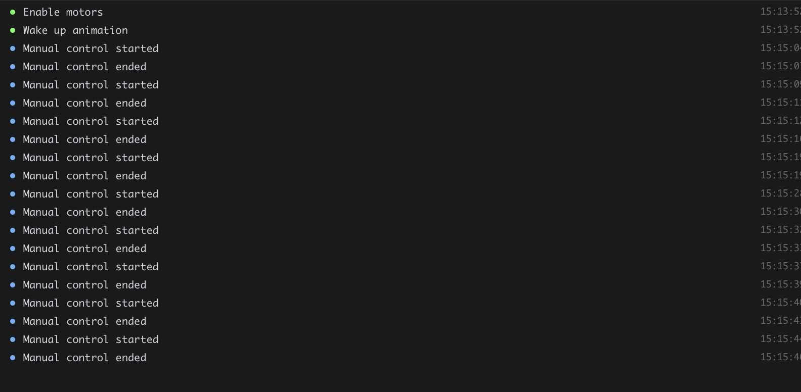
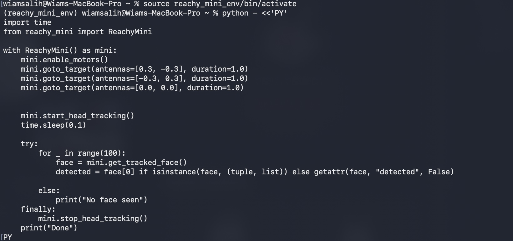

# INFO 5356-030 Lab 2: HRI Research Methods

## Team Members
Nophar Shalom, Bailey Carlson, Wiam Salih

---

## 1. Teleoperation on the Physical Robot

### Final App Cycle Clip
[▶️ Watch the physical Reachy control demo](images/reachy-control.mov)

### Stage Markers (Screenshot / Log Excerpt)


### Sim-to-Real Comparison

The real robot didn't move as smoothly as it did in the simulation. Its motions were often a bit jerky or hesitant, probably because of things the simulation didn't account for, like motor delays, friction in the joints, and small quirks in the hardware. It was also fairly noisy. The motors and gears made sounds with every movement, so you could tell what the robot was doing just by listening to it.

---

## 2. Hello World Application

### Demonstration Clip
[▶️ Watch the application demo](images/hello-world.mov)

```
python - <<'PY'
import time
from reachy_mini import ReachyMini

with ReachyMini() as mini:
    mini.enable_motors()
    mini.goto_target(antennas=[0.3, -0.3], duration=1.0)
    mini.goto_target(antennas=[-0.3, 0.3], duration=1.0)
    mini.goto_target(antennas=[0.0, 0.0], duration=1.0)

   
    mini.start_head_tracking()
    time.sleep(0.1)

    try:
        for _ in range(100):         
            face = mini.get_tracked_face()
            detected = face[0] if isinstance(face, (tuple, list)) else getattr(face, "detected", False)
        
        else:
            print("No face seen")
    finally:
        mini.stop_head_tracking()      
    print("Done")
PY
```
### Stage Markers (Screenshot / Log Excerpt)



### Changes, Expected Outcomes, and Actual Outcomes

With the Hello World code, we edited it to include face tracking alongside the antenna movements from the original code. When a participant moves their head, Reachy could now move its head in regards to their movement, creating a more immersive conversation experience. In this case, because it was a simple change, our expected outcomes seemed to match the actual outcomes.

---

## 3. Custom App on the Physical Robot

[Check out our Custom App code here!](talking_study_app.py)

### Final-Project Topic and App Capabilities

In any case, our final project topic will include interactive features that enable the user to converse with Reachy Mini. Those conversations will require both conversation feedback and gestures, alongside face tracking to keep the user engaged. Because our target audience will be middle school children, we want the experience to be as intuitive as possible. This includes making sure that they feel heard and supported by the Reachy Mini, regardless of the task at hand. We are incorporating the capabilities from the Conversational App and the Greetings App for Reachy Mini.

### Integration Map

| Source App | Capability Reused | Modified | Interaction Goal | Final-Project Connection |
|---|---|---|---|---|
| Reachy Mini Conversation App | We used the verbal greetings from the beginning and end of the conversation. | We modified the prompt that the user recieves (e.g. the question asked) as well as the feedback responses provided to the user from Reachy as they converse.| The goal was to make sure that the user feels verbally assured as they speak, to make sure that they know they're heard.| In a normal conversation, the user would need to know that they are being heard and engaged with.|
| Gestures Library | We used the initial gestures (head nodding, antenna crossing, etc.)| We added facial tracking for a smoother user experience overall. | The goal was for maximum attentiveness from the robot, almost as if they are human.| Immersiveness and human-like attention is the goal, especially when it comes to children because they like to get attention.|

### Setup, Launch, and Stop Instructions

### Robot-Only Demonstration
[Watch the robot demo](images/conditionA.mov)
[Watch the robot demo](images/conditionB.mov)
---

## 4. HRI Research Questions

### Problem Statement
When people talk to someone, they rely on small listener signals, like nods, to judge whether they are being heard. These signals are called backchannels (Yngve, 1970). Social robots are increasingly deployed as conversational partners in homes, schools and care settings, yet many stay motionless while a person speaks. A robot that stays still while listening may come across as inattentive or less socially present, even if its spoken responses are appropriate. Prior work shows that nonverbal backchanneling from virtual agents increases rapport (Gratch et al., 2007) and that robot backchanneling affects how engaged speakers are (Park et al., 2017). Less is known about whether a simple, low-degree-of-freedom robot like Reachy Mini can produce this effect with head nods alone. This pilot study tests whether adding active-listening nods changes how sociable adults perceive Reachy Mini to be during a short conversation, and whether nods affect how long participants choose to speak.

### Construct Map

| Claim | Manipulation | Measures | Expected Evidence |
|---|---|---|---|
| Active-listening nods make Reachy Mini seem more sociable | `NOD_AMPLITUDE_DEG`: 0° (A) vs 10° (B), triggered throughout the conversation | HRIES sociability (primary) | Higher sociability scores in Condition B than in Condition A for most participants |
| Participants notice the listening behavior | Same as above | Manipulation-check item | Higher agreement in Condition B than in Condition A |
| Nods encourage participants to keep talking | Same as above | Speaking time (s) | Longer speaking time in Condition B than in Condition A |
| Nods may feel unnatural if mistimed (exploratory) | Same as above | HRIES disturbance; open-ended responses | No predicted direction; qualitative comments on timing or naturalness |

#### Independent Variable

`NOD_AMPLITUDE_DEG` is the peak downward head pitch, in degrees, of the nod the robot performs when it detects a pause in the participant's speech.

- **Condition A (baseline):** 0°. The conversational engagement responses from Reachy continue, but no movement is produced.
- **Condition B (comparison):** 10°. The robot performs head tracking and the head nodding over NOD_DURATION_S = 0.6 seconds.

In both conditions, the Reachy Mini responds to the user with the same prompts, questions, tone of voice, verbal greetings, and order of comments.

#### Outcomes

- **Primary outcome:** HRIES sociability score. This is the mean of the four sociability items, each rated on a 7-point scale, so scores range from 1 to 7. Higher values mean the robot was perceived as more sociable.
- **Secondary outcomes:** HRIES animacy, agency and disturbance scores, each the mean of its four items. Higher values mean greater animacy, agency or disturbance, respectively.
- **Objective outcome:** total participant speaking time in seconds during the conversation window.

#### Manipulation Check

After each completed run, participants rate the statement "The robot responded to what I was saying with head movements" from 1 (strongly disagree) to 7 (strongly agree). The manipulation is considered noticeable if ratings are higher in Condition B than in Condition A.

#### Controls

- The robot's idle pose, antenna position, gaze direction, and start and end pose are identical in both conditions.
- Two conversation prompts of similar difficulty are used, and the pairing of prompt to condition is counterbalanced.
- The room layout, participant seat distance from the robot, lighting and facilitator position are the same for every session.
- The facilitator reads a standardized script and does not react to the robot's behavior.
- Condition order is counterbalanced (AB, BA, AB, BA).
- Conversation topic order is consistent (place, food)

#### Potential Confounds

- **Prompt content:** One prompt may be easier to talk about.
- **Order and novelty effects:** Participants may talk more or rate the robot differently in the second session simply because the robot is no longer novel.
- **Detection errors:** Facilitator robot response timing may cause disruptions in the conversational flow between the user and robot.
- **Facilitator presence:** Participants may speak to please the facilitator rather than responding to the robot. The facilitator sits out of the participant's line of sight.

#### Measurement Scales and Construct Validity

The HRIES (Spatola, Kühnlenz & Cheng, 2021) has 16 items rated on a 7-point scale, with four items per dimension:

- **Sociability:** warm, likeable, trustworthy, friendly
- **Animacy:** human-like, real, alive, natural
- **Agency:** self-reliant, rational, intentional, intelligent
- **Disturbance:** scary, strange, creepy, weird

### Research Questions and Hypotheses

**H1 (confirmatory):** Participants will report higher HRIES sociability scores in the nodding condition (B, 10°) than in the still condition (A, 0°).

**H2 (confirmatory):** Participants will speak longer in the nodding condition (B) than in the still condition (A).

**RQ1 (exploratory):** How do active-listening nods affect participants' HRIES disturbance ratings and their descriptions of the robot's behavior?

---

## 5. HRI User Study

### Conditions Table

| Element | Condition A | Condition B | Held Constant |
|---|---|---|---|
| Primary factor | Nod amplitude of 0°. The robot stays still when the participant pauses. | Nod amplitude of 10°. The robot gives one small nod each time the participant pauses. | Reachy response to each user comment. |
| Robot behavior | The robot holds its neutral pose for the whole conversation. | The robot holds its neutral pose and nods down and back up over 0.6 s at each pause. | Starting pose, idle antenna position, gaze direction, and return to neutral at the end. |
| Interaction | The participant talks to the robot for 3 minutes about an assigned prompt. | Same task, using the other prompt. | Instructions, 3-minute time limit, room setup, facilitator, and operator. |

### Participants

#### Target Population and Sampling Rationale

Our target population is adults who might talk to a social robot in everyday settings, such as at home, at a front desk or in a classroom. For this pilot, we recruited at least four adult volunteers from the Cornell Tech community who are not members of our team. We used a convenience sample because the goal of a pilot is to test whether the task, the robot behavior and our measures work before running a larger study, not to make claims about the general population.

#### Demographics, Robot Familiarity, and Condition Order

We collected only information that could reasonably affect how someone talks to or judges a robot: age range, how comfortable they are speaking English, and how familiar they are with robots, rated from 1 (never interacted with a robot) to 7 (work with robots regularly). Each participant was given an ID, and their condition order and prompt order were assigned before their session began. Pairing the orders this way means each condition is seen first twice and each prompt is used with each condition twice.


| Participant ID | Age Range | English Comfort | Robot Familiarity (1–7) | Condition Order | Prompt Order |
|---|---|---|---|---|---|
| P01 | | | | A then B | Place, then Meal |
| P02 | | | | B then A | Place, then Meal |
| P03 | | | | A then B | Meal, then Place |
| P04 | | | | B then A | Meal, then Place |

#### Limits on Transferability

With only four participants, all drawn from a tech-focused graduate campus, our results can't tell us how people in general would react to a nodding robot. Our participants are likely more comfortable with technology and more curious about robots than most people. They also know they are taking part in a class study, which may make them more patient or more generous in their ratings. Any pattern we find should be treated as a reason to run a larger study, not as a conclusion

### Study Task

#### Task and Standardized Instructions

#### Trial Definitions

In each condition, the participant sits facing Reachy Mini and talks to it for 3 minutes about a topic printed on a card. The two topics are:

- **Place:** "Tell the robot about a place you like to spend time, and why you like it."
- **Meal:** "Tell the robot about a meal you really enjoy, and what makes it special."

We chose these topics because anyone can talk about them without special knowledge, and they're personal enough to encourage natural, flowing speech with pauses. The facilitator reads the same instructions before each condition:

> "For the next three minutes, please talk to the robot about the topic on this card. Speak to it as you would to someone who is listening to you. There's no right or wrong way to do this. I'll let you know when the time is up."

If the participant stops talking for more than 15 seconds, the facilitator can say once: "Feel free to keep going, or add anything else that comes to mind."

| Trial Status | Definition |
|---|---|
| Completed | The full 3-minute conversation ran, the robot behaved as intended for that condition, and the participant filled out the questionnaire. |
| Interrupted | The conversation was paused before 3 minutes, for example because of a noise, a question from the participant, or the operator pressing stop, and then resumed. We record how long the pause lasted and why it happened. |
| Failed | The condition couldn't be delivered as designed, for example the robot didn't nod in Condition B, moved in Condition A, or lost connection, or the participant chose to stop. |
| Repeated | A failed condition that we ran again from the start. We only repeat a condition if the failure happened in the first 30 seconds, and we note the repeat in the session record. |

#### Setting and Environmental Controls

Every session takes place in the HRI Lab. Reachy Mini sits on a table at roughly the participant's seated eye level, and the participant's chair is placed at about 1 meter in front of it. The facilitator sits to the side, out of the participant's direct line of sight, so the participant naturally speaks to the robot rather than to a person. A second team member sits at the laptop with the stop control, also out of direct view.

### Facilitator Script

**Before the participant arrives**

We power on the robot, confirm the battery and motors look normal, and run a short test of both conditions to make sure the robot stays still in Condition A and nods in Condition B. We check that the log is recording and put the robot in its neutral pose.

**Welcome and agreement to participate**

> "Thanks for participating! Today you'll have two short conversations with a small robot called Reachy Mini, and after each one you'll fill out a brief questionnaire. The whole session takes about 10 minutes. We're interested in how people experience talking to robots. We won't record video of you, but the robot will log when you are speaking so we can measure the conversation. Your responses will be stored and you can skip any question or stop at any time without any problem. Do you have any questions?"

**Background questions**

We ask the participant their age range, how comfortable they are speaking English, and how familiar they are with robots (1–7).

**First conversation**

We hand the user the first topic card and read the standard instructions and signal the operator team member to start the first condition. After 3 minutes, we'll say: "Thank you, that's time." Hand over the post-conversation questionnaire.

**Between conversations**

While the participant fills out the questionnaire, the operator team member will return the robot to neutral and loads the second condition.

**Second conversation**

We hand them the second topic card and read the same instructions, then run the second condition the same way, then hand over the second questionnaire.

**Debrief**

> "Thank you. Now we can tell you what we were looking at. In one of your conversations, the robot nodded slightly whenever you paused, and in the other it stayed still. We wanted to know whether those small nods change how friendly or attentive the robot seems, and whether they affect how much people talk. Did you notice a difference? Do you have any questions?"

### Measures

#### HRIES Questionnaire

Participants rate how well each word describes the robot on a 7-point scale, from 1 (not at all) to 7 (very much). The 16 words are shown in a mixed order, and the same order is used every time. Each dimension is scored separately.

| Dimension | Items |
|---|---|
| Sociability (primary outcome) | Warm, Likeable, Trustworthy, Friendly |
| Animacy | Human-like, Real, Alive, Natural |
| Agency | Self-reliant, Rational, Intentional, Intelligent |
| Disturbance | Scary, Strange, Creepy, Weird |

#### Objective Behavioral Measure

Total speaking time, in seconds, during the 3-minute conversation. The app measures this from the microphone by adding up the time the participant was speaking. We also record how many times the facilitator had to prompt the participant to keep going.

#### Open-Ended Question

"How would you describe the robot's behavior while you were talking?"

#### Manipulation-Check Item

"The robot responded to what I was saying with head movements." Rated from 1 (strongly disagree) to 7 (strongly agree).


### Interruptions, Missing Data, Robot Faults, and Protocol Deviations

---

## 6. Research Data

### Datasets

### Data Dictionary

| Variable | Definition | Response Scale | Units | Missing-Data Code |
|---|---|---|---|---|
| | | | | |

### Scoring Calculations

### Missing Data, Exclusions, and Corrections

---

## 7. Analysis and Reflection

### Participant Accounting

### Results Table

| Measure | Condition A | Condition B | Within-Participant Difference (A − B) |
|---|---|---|---|
| HRIES Sociability | | | |
| HRIES Animacy | | | |
| HRIES Agency | | | |
| HRIES Disturbance | | | |
| Objective Measure | | | |

### Participant-Level Paired Figure

### Interpretation by HRIES Dimension

### Qualitative Coding Table

| Category | Definition | Summary of Findings | Example Excerpt / Paraphrase |
|---|---|---|---|
| | | | |

### Answers to Research Questions / Hypotheses

### Convergence and Disagreement Among Evidence

### Alternative Explanations

### Threats to Validity

### Proposed Interaction Improvement

### Proposed Follow-Up Study

---

## 8. Report

### Introduction

### Method

### Results

### Discussion

### References

### Appendix

---

## How to Reproduce the Analysis
